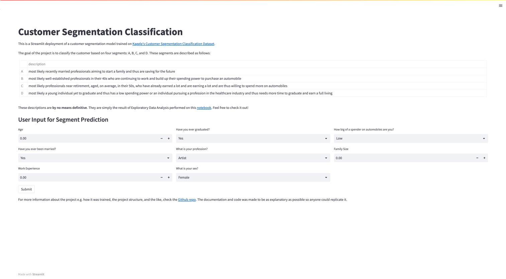

# Streamlit Model Deployment of an Machine Learning-based Customer Segmentation Model

## Overview

This is a customer segmentation project based on the [Customer Segmentation Classification Dataset](https://www.kaggle.com/datasets/kaushiksuresh147/customer-segmentation?select=Train.csv) from Kaggle. 

Customer segmentation is the process of dividing customers into groups based on common characteristics so that companies can market to each group effectively and appropriately. It is an important tool for businesses to identify their most valuable customers and develop targeted marketing campaigns to increase sales and customer loyalty.

## Project Structure

Shown below is the organization of the project:

    ├── README.md          <- The top-level documentation for this project.
    ├── data
    │   ├── processed      <- The final data sets for customer segmentation.
    │   └── raw            <- The original, immutable datasets.
    │
    ├── images             <- The images used in the README documentation
    ├── notebooks          <- Jupyter notebooks containing the explorations performed in this project
    ├── requirements.txt   <- The requirements file for reproducing the project
    ├── src                <- Source code used in this project.

## Code Files and Jupyter Notebooks

Following the preceding structure, the succeeding list are the code files and their descriptions:
* `notebooks/handling_missing_values.ipynb`: notebook containing data cleaning and preprocessing specifically on handling columns with missing values
* `notebooks/eda_on_segments.ipynb`: notebook containing exploratory data analysis and segment description generation
* `notebooks/feature_engineering.ipynb`: notebook containing creation of new features for training
* `src/app.py`: Streamlit web application for the customer segmentation model
* `src/utils.py`: contains all helper functions for cleaning, preprocessing, training, and deployment
* `src/train.py`: code for training and selecting the best customer segmentation model
* `models/model.joblib`: best trained model (gradient boosting classifier)

## Features 

The dataset contains the following features:

* ID: Customer ID
* Gender: Gender of the customer
* Age: Age of the customer
* Spending Score: Score assigned based on customer behavior and spending nature
* Family Size: Number of family members of the customer
* Graduated: Whether the customer has graduated or not
* Profession: Profession of the customer
* Work Experience: Work experience of the customer in years
* Var_1: Anonymised category for the customer
* Segmentation: (target) Customer segment 

## Methodology

1. Data cleaning: Handling missing values by dropping those with less than 3% of the data and performing KNN Imputation for those with greater than 3% missing data. It was also found through the `missingno` library that there seems to be no correlation between missing values, so each one was handled independently. 
2. Feature engineering: New features were determined and for this case, the main change was the inclusion of an `Other` profession category to include those who have less than 5% of total observations. The `Other` category was also included to allow for that input option in the Streamlit model deployment because in a practical use case scenario, there are tons of different professions so the model should be able to handle those cases. 
3. Encoding and scaling: Scaling for numerical values was achieved using the MinMax Scaler because of the skewed distributions in all numerical features. For categorical features, three encoding schemes: onehot, label, and ordinal encoding were used. The order of the columns after encoding and scaling were taken note of as this order must be followed for the inputs during deployment. 
4. Training and tuning: The model was trained with six classifiers: logistic regression, knn, decision trees, naive bayes, random forests, and gradient boosting with the best performing model in terms of accuracy being selected and tuned via GridSearchCV. Model saved using joblib.
5. Deployment: Inputs were taken from the user and the same encoding and scaling schemes were applied and a dataset with shape (1, 16) was generated for prediction. The model, loaded in using joblib, then predicts and gives a resulting customer segmentation. 

## Using the Repo

To run the application, first create a virtual environment. I used [miniconda](https://docs.conda.io/en/latest/miniconda.html) as my virtual environment manager and create an environment with the following command: 

```python
conda create --name segmentation python=3.9
conda activate segmentation
```

The next step is to clone the repository in the virtual environment by running:

```python
HTTPS: git clone https://github.com/gersongerardcruz/customer_segmentation.git
```

```python
SSH: git clone git@github.com:gersongerardcruz/customer_segmentation.git
```

Then, move into the repository and install the requirements with:

```python
cd customer_segmentation
pip install -r requirements.txt
```
Finally, deploy the app locally via streamlit by moving into the `src` directory and running:

```python
cd src
streamlit run app.py
```

The streamlit app should look like this: 



If you want to train a new model after having changed updated the training data, use the following command while still in the src folder:

```python
python3 train.py
```

This command will train and tune a new method based on the best scoring classifier and update the `model.joblib` file in the `models` directory.  

## Future Recommendations

* Collect better and more distinguishing data on customer behavior and preferences to improve segmentation accuracy
* Explore additional features that could provide valuable insights into customer behavior and preferences, such as purchase history, social media activity, and customer feedback.

## Conclusion

Customer segmentation is an important tool for businesses to effectively target and engage their most valuable customers. This project demonstrates the use of machine learning algorithms to segment customers based on their demographic and behavioral characteristics. With more distinguishing and improved data, this model can be further refined to provide even more accurate customer segmentation.